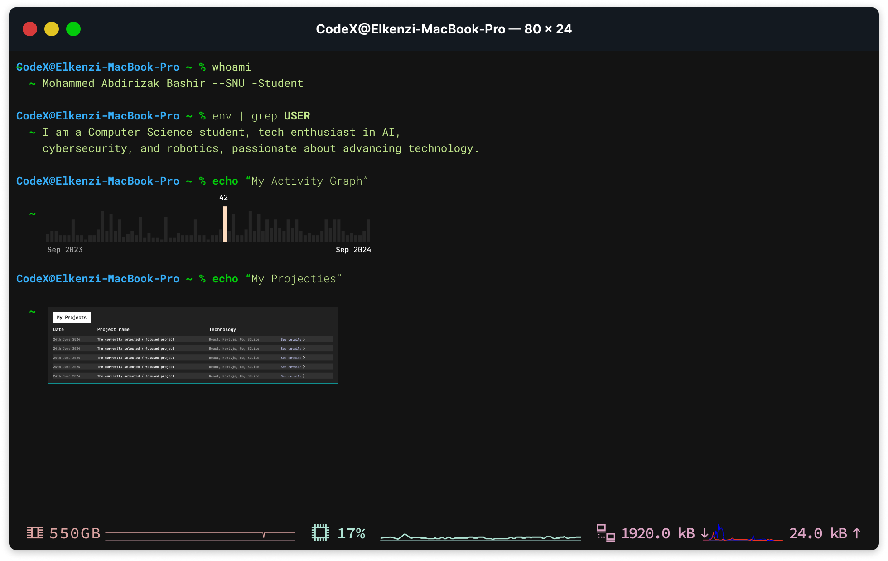

<!--Contact Section--> 

<h2 align="center">🤝 Connect With Me 🤝</h2>

  
  
  
  
  
  

 

  

### 👋 About Me
I'm a passionate technologist focused on leveraging technology to create meaningful impact, particularly in educational technology and cybersecurity. Based in Somalia, I'm dedicated to bridging the digital divide and empowering the next generation of tech professionals.

### 🔭 Current Focus
- Advancing cybersecurity solutions and best practices
- Developing AI-powered educational platforms
- Creating innovative learning tools for technology education
- Building robust software solutions with a focus on security

### 💡 Areas of Expertise
- Full-Stack Development
- Cybersecurity
- Artificial Intelligence
- Educational Technology
- Robotics

### 🤝 Collaboration
I'm actively seeking collaboration opportunities in:
- Open-source educational technology projects
- Language learning platforms
- Security tools and frameworks
- Initiatives that promote tech education in East Africa

---
### 🤝 Let's collaborate and build something amazing together! 🤝